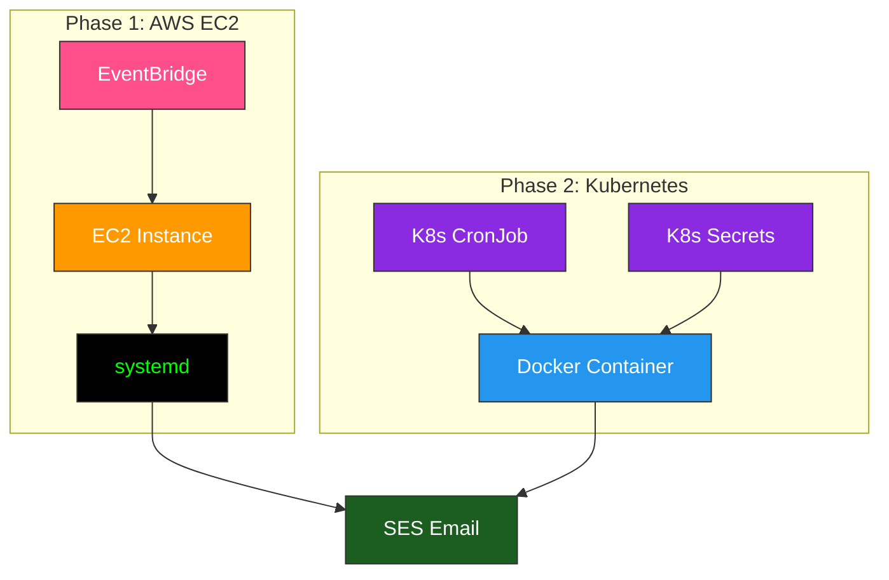

# Production-Ready Portfolio Tracker with Event Scheduling
Automated daily portfolio reporting on a scheduled EC2 instance, with systemd launching Python scripts at startup.

## The Problem

A client wanted a daily email summary of their $200k investment portfolio delivered automatically 
after the market closes, with a reliable, hands-off process requiring no manual effort.

---

**Phase I:** AWS EC2 & EventBridge Automation
Designed a Start → Run → Stop automation system on AWS. Instead of running continuously,
the server wakes up for ~10 minutes per day to complete the task and then shuts down.

**Phase II:** Kubernetes (K8s) Modernization
I upgraded the project into a containerized microservice to learn modern cloud-native orchestration and secure 
credential management.

Setup & Deployment
Detailed step-by-step instructions for Docker builds, K8s Secrets, and CronJob scheduling are located in the SETUP.md 
file at the root of this project.

## Data Processing Workflow

---

## How It Works

### Trigger
AWS EventBridge starts the EC2 instance at a scheduled time.

## EventBridge Start Instance

### Execution
When Linux boots, a **systemd service** automatically launches the Python scripts.

## Systemd Service Status

### Processing Logic

The scripts:

- Pulls live market prices using the yfinance API.
- Auto-generates HTML reports and distributes them via Amazon SES.
- Calculates portfolio value and progress toward the $200k goal.

### Reporting
Clean, easy-to-read email reports were sent using **Amazon SES**.

**NOTE:**

(Portfolio holdings, values, and email recipients are **DEMONSTRATION DATA** ONLY. This project showcases automation, 
reporting, and AWS service integration.)

### Shutdown
A second EventBridge rule stops the instance to minimize compute costs.

## EventBridge Schedule

---

## Technical Solutions

**Linux Automation**  
Configured systemd to ensure scripts execute immediately at boot.

**Secure Permissions**  
Configured IAM roles to allow AWS services to communicate securely.

---

