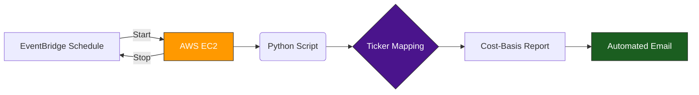

# Scheduled Portfolio Tracker (AWS EC2 + Python)

## The Problem
A client who needs a daily email update on their **$200k portfolio**, but they didn't want to pay for
a server running 24/7.
---

## The Solution
Designed a **Start → Run → Stop** automation system on AWS.

Instead of running continuously, the server wakes up for ~10 minutes per day to complete the task and then shuts down.

## Data Processing Workflow

---

## How It Works

### Trigger
AWS EventBridge starts the EC2 instance at a scheduled time.

### Execution
When Linux boots, a **systemd service** automatically launches the Python scripts.

## Systemd Service Status

### Processing Logic

The scripts:

- Pulls live market prices using the yfinance API.
- Auto-generates HTML reports and distributes them via Amazon SES.
- Calculates portfolio value and progress toward the $200k goal.

### Reporting
Clean, easy-to-read email reports were sent using **Amazon SES**.

### Shutdown
A second EventBridge rule stops the instance to minimize compute costs.

## EventBridge Schedule

---

## Technical Solutions

**Linux Automation**  
Configured systemd to ensure scripts execute immediately at boot.

**Secure Permissions**  
Configured IAM roles to allow AWS services to communicate securely.

---

