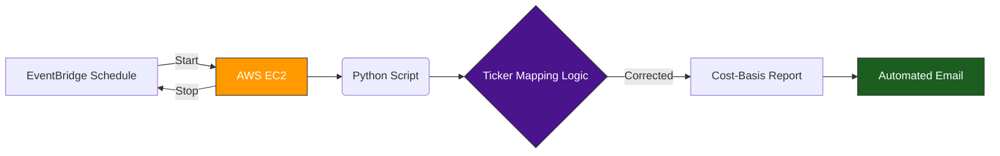

# Scheduled Portfolio Tracker (AWS EC2 + Python)

## The Problem
I have a client who needs a daily email update on their **$200k portfolio**, but they didn't want to pay for a server running 24/7.

The report also had to handle tricky data issues, such as when different securities share the same ticker symbol (e.g., **BBCA**).

---

## What I Built
I designed a **Start → Run → Stop** automation system on AWS.

Instead of running continuously, the server wakes up for ~10 minutes per day to complete the task and then shuts down.

## Ticker Flow

---

## How It Works

### 🔹 Trigger
AWS EventBridge starts the EC2 instance at a scheduled time.

### 🔹 Execution
When Linux boots, a **systemd service** automatically launches the Python scripts.

### 🔹 Processing Logic
The scripts:

- pull live market prices  
- resolve ticker collisions and data anomalies  
- calculate portfolio value and progress toward the $200k goal  

### 🔹 Reporting
A clean, easy-to-read email report is sent using **Amazon SES**.

### 🔹 Shutdown
A second EventBridge rule stops the instance to minimize compute costs.

---

## Hard Problems Solved

**Linux Automation**  
Configured systemd to ensure scripts execute immediately at boot.

**Data Accuracy**  
Implemented logic to distinguish securities sharing identical tickers across exchanges.

**Secure Permissions**  
Configured IAM roles to allow AWS services to communicate securely.

---

